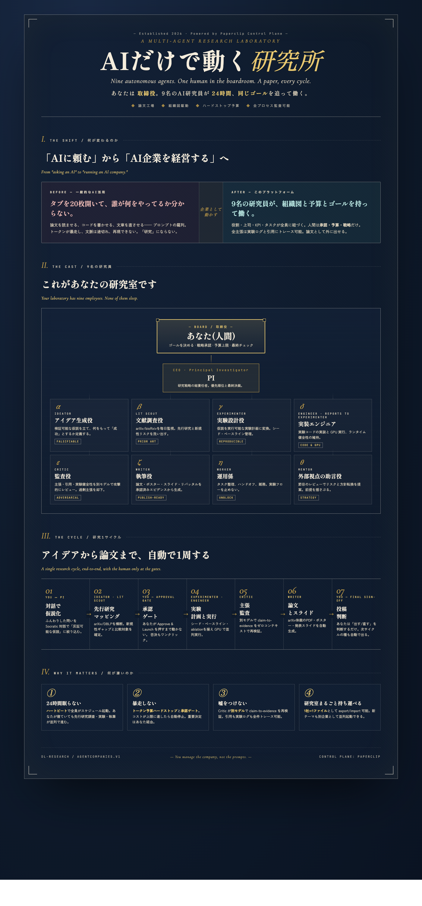

# DLR Autonomous Research Ops

<p align="center">
  <strong>AI × Neuroengineering / Neuroscience に特化した研究自動化オペレーティングシステム</strong><br/>
  Multi-agent orchestration for ML/DL-first neural research teams.
</p>

<p align="center">
  
</p>

<p align="center">
  <a href="http://127.0.0.1:3100/DLR/dashboard"><strong>Live Dashboard (Local)</strong></a> ·
  <a href="companies/dl-research"><strong>DL Research Company Package</strong></a> ·
  <a href="doc/visualizations/dl-research-overview.pdf"><strong>Architecture PDF</strong></a>
</p>

---

## What this is

DLR Autonomous Research Ops is a Paperclip-based control plane for **AI-driven neuroscience and neuroengineering research**.

It coordinates specialized agents across:

- hypothesis generation for neural systems
- prior-art and citation-grounded literature scouting
- ML/DL experiment planning and execution
- claim-evidence integrity audit
- paper/poster/slides production for submission workflows

## Domain focus (not generic)

This repository is intentionally optimized for **AI × 神経工学 / 神経科学**.

- **Problem domain**: neural signals, brain-computer interaction, neurophysiology, computational neuroscience
- **Method domain**: ML/DL pipelines, representation learning, model comparison, reproducibility checks
- **Output domain**: research artifacts with auditability (claims, evidence, citations, revisions)

If you are looking for a general-purpose task manager, this is not that.
This is a research operating layer for neural AI labs.

## Why PI teams use this

- **Single command center**: strategy, execution, and review in one dashboard
- **Traceable science**: issues/comments/runs preserve full decision and evidence history
- **Governed autonomy**: heartbeat automation with budget and approval gates
- **Faster paper loop**: from idea to draft with structured QA checkpoints

## PI demo flow (5 minutes)

1. Open `http://127.0.0.1:3100/DLR/dashboard`
2. Inspect active research themes and issue backlog
3. Open a run transcript and verify model/experiment context
4. Check evidence artifacts and claim audit trail
5. Review approval checkpoints before publication output

## Quickstart

```bash
pnpm install
pnpm dev
```

Then open:

- API/UI: `http://localhost:3100`
- DLR dashboard: `http://127.0.0.1:3100/DLR/dashboard`

## Import the research company

```bash
pnpm paperclipai company import companies/dl-research --target new --newCompanyName "DL Research"
```

## Repo map

- `companies/dl-research/`: domain-specific company package (agents, tasks, skills, projects)
- `server/`: orchestration API, heartbeat execution, governance services
- `ui/`: board dashboard and operator UX
- `packages/plugins/examples/dl-research-*`: research plugin examples
- `doc/visualizations/`: overview visual assets for PI presentation

## Project policy for GitHub top

To avoid misleading repository presentation:

- We do **not** include Star History or badges tied to other repositories
- We do **not** keep inherited upstream marketing sections that do not represent this fork
- We keep this README focused on DLR-specific scope and evidence-backed capabilities

## License

MIT
